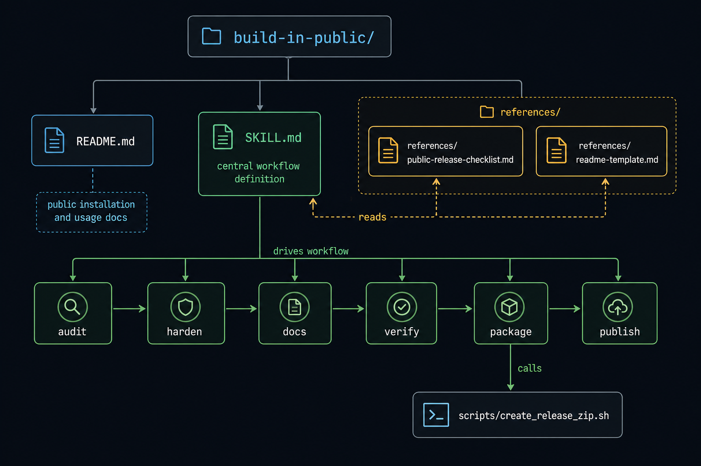
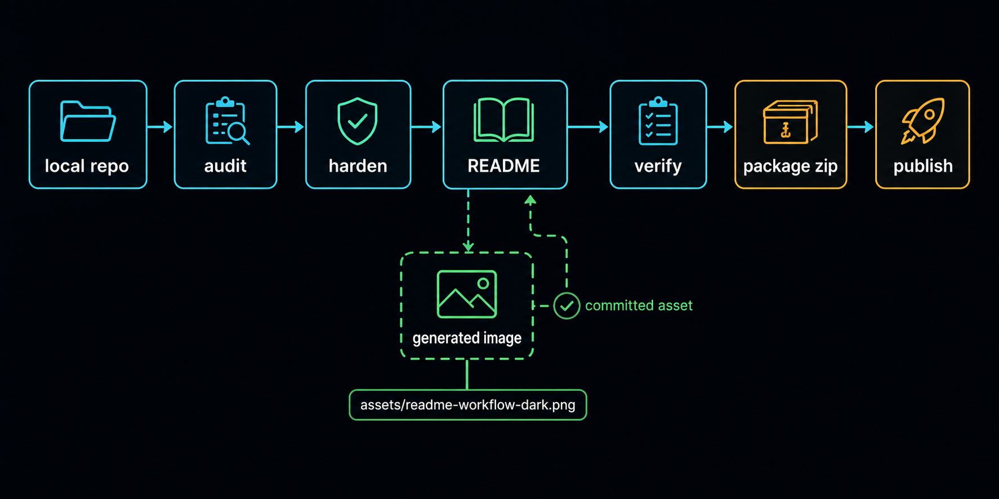

```
 _       _ _   _    _                _   _ _     
| |_ _ _|_| |_| |  |_|___    ___ _ _| |_| |_|___ 
| . | | | | | . |  | |   |  | . | | | . | | |  _|
|___|___|_|_|___|  |_|_|_|  |  _|___|___|_|_|___|
                            |_|                  
```

# build-in-public

> A skill for turning a working local repo into a public-ready project: audit risk, tighten setup, write clearer docs, package a clean archive, and publish to GitHub when appropriate.

[](https://github.com/davidvictor/build-in-public)
[](LICENSE)
[](#)



## The Problem

The working one has hardcoded paths, stale credentials in an `.env` that never got `.gitignore`d, scratch commits with debug tokens, and a README that made sense to you six weeks ago but tells a stranger nothing. Most small tools that solve real problems never get published because closing that gap feels like a separate project.

## Why I Built This

The approach here is to treat the release pass as a skill, not a checklist. The skill reads the project, reasons about what needs hardening, and writes the docs from what it finds in the code. When the git history is safe to expose, it hardens in place; when it contains scratch work or private context, it prepares a clean export repo instead. Built during a run of publishing long-dormant personal tools, shared here because the pattern kept working.

## What It Does

Given a local repo that already works, the skill:

1. **Audits** for secrets, private paths, local credentials, and history that shouldn't be public
2. **Hardens** install steps, `.gitignore`, `env.example`, and the primary entrypoint
3. **Writes** a README following a practical template — problem, purpose, what it does, quick start, limitations
4. **Packages** a clean release zip using `git archive` (committed files only, no working tree debris)
5. **Publishes** a public GitHub repo with a prepared description and topic tags

## Included Files

| File | What it is |
|------|------------|
| [`SKILL.md`](SKILL.md) | The skill definition |
| [`assets/repo-structure-dark.png`](assets/repo-structure-dark.png) | Generated dark-mode diagram of the repository structure |
| [`assets/readme-workflow-dark.png`](assets/readme-workflow-dark.png) | Generated dark-mode diagram of the release workflow |
| [`references/public-release-checklist.md`](references/public-release-checklist.md) | Gate checklist used before publishing |
| [`references/readme-template.md`](references/readme-template.md) | README structure template used when writing docs |
| [`scripts/create_release_zip.sh`](scripts/create_release_zip.sh) | Packages a clean zip from committed HEAD |

## How It Works

The skill reads the project, forms a short public framing, asks you to confirm the intent when needed, and uses the code as the source of truth for docs and release decisions.

The release strategy distinguishes between two lanes: harden in place when the existing repo and git history are safe to expose, or create a clean public-export repo when the working project is good but the history has scratch commits, private notes, or experimental debris. The skill defaults to the safer lane.



## Optional Accelerators

The core workflow — audit, harden, docs, package, publish — runs on ordinary shell, git, and GitHub CLI. Some host environments offer additional capabilities the skill will use when available: native image generation for README visuals and repo maps (available in Codex; use Mermaid or SVG in other environments), web search for current external facts before publishing, browser review for local web previews, and worktrees or subagents for parallel work.

## Quick Start

Install via the `skills` CLI:

```bash
npx skills add davidvictor/build-in-public
```

To install globally without prompts:

```bash
npx -y skills add davidvictor/build-in-public -g -y
```

To preview what would be installed without touching your filesystem:

```bash
npx skills add davidvictor/build-in-public --list
```

Once installed, run against any repo you want to publish:

```
build in public
```

Or, if slash commands are available:

```
/build-in-public
```

## Usage

Point the skill at any local repo that already solves a real problem. It will:

1. Read the code and form hypotheses about the motivation
2. Ask you to confirm "the spark" (one of three proposed options, or your own phrasing)
3. Run the full audit → harden → docs → package → publish pass
4. Report the GitHub URL when done

The skill also works outside the default workspace — point it at any local path and it adapts.

To update to the latest version after installing:

```bash
npx skills update
```

Or re-run `npx skills add davidvictor/build-in-public` — the CLI re-clones from `main` and overwrites.

For manual install:

```bash
git clone https://github.com/davidvictor/build-in-public <your-skills-dir>/build-in-public
```

## Requirements

- A local skills setup that can load `SKILL.md`
- Node.js/npm for the `npx skills` install path
- `git` for repo inspection and archive packaging
- `unzip` for release zip verification
- `gh` CLI for the GitHub publish step, with `gh auth login` configured
- `figlet` for the ASCII banner (`brew install figlet` on macOS)

## Limitations

- Tested on macOS. The shell scripts should work on Linux; Windows paths are not handled.
- Publishing requires GitHub and an authenticated `gh` CLI; audit, docs, and packaging can run without it.
- The skill is opinionated about README structure. If your project needs a different format, edit `references/readme-template.md` after cloning.
- History rewriting is explicitly out of scope — the skill prefers a clean public-export repo over `git filter-branch` surgery.
- The ASCII banner depends on `figlet`; install it first if you want that step included.
- Generated visuals depend on the host runtime. If native image generation is unavailable, use Mermaid or another repo-native diagram instead.

## License

MIT
